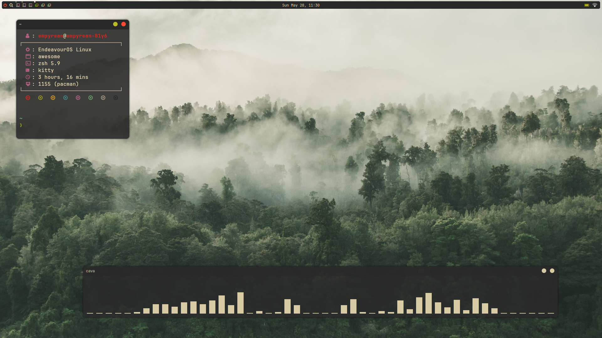

# Awesome Window Manager

## Screenshots

## Installation

Download the latest release and run the install script

**:heavy_exclamation_mark: Release v1.0.0 does not have an installer**

## Configuration

The main configuration file is `rc.lua`. The status bar can be configured in `wibar.lua`, and the titlebar in `titlebar.lua`.

## To-do

- [ ] move keybinds to separate file
- [X] improve wibar
